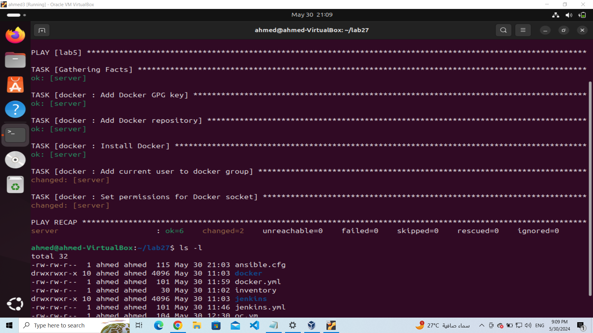
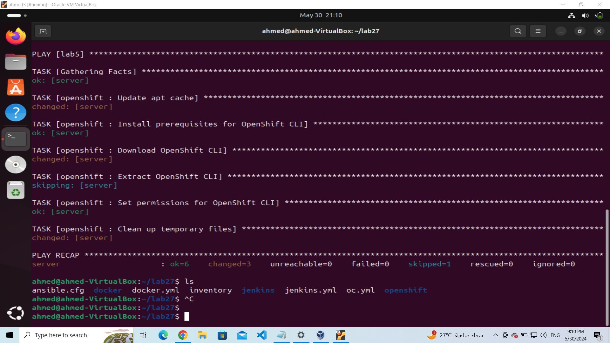

# ivolve internship
## lab27 
## ansible roles 

Create a 3 ansible roles to install docker , jenckins and openshift CLI 

### 1. Dockker ansible role 
constan some tasks to update packages ...... to install docker 
Task 1 : Download GPG key for docker

```
- name: Add Docker GPG key
  apt_key:
    url: https://download.docker.com/linux/ubuntu/gpg

```
*******************
Task 2: add docker repository to get docker package 

```
- name: Add Docker repository
  apt_repository:
    repo: deb [arch=amd64] https://download.docker.com/linux/ubuntu {{ ansible_distribution_release }} stable

```
*******************
Task 3: Install Docker package "docker-ce"

```
- name: Install Docker
  apt:
    name: docker-ce

```
*****************
Task 4: Add my user to the docker group to get all permissions for docker file and commands

```
- name: Add current user to docker group
  command: usermod -aG docker $USER

```
*****************
Task 5: Set mode "0666" for docker/sock

The command you provided is used to set permissions for the Docker socket (/var/run/docker.sock). This step is often necessary when working with Docker, especially in scenarios where you want to allow non-root users or applications to interact with the Docker daemon.
we also may need this permission specialy while integrating docker with jenkins

```
- name: Set permissions for Docker socket
  file:
    path: /var/run/docker.sock
    mode: "0666"
```
###################


### 2. openshift ansible role

Use this role to install openshift cli on the host machine

Task 1: install wget package to use it in the next tasks for downloading 

```
- name: Install prerequisites for OpenShift CLI
  apt:
    name:
      - wget

```
****************
Task 2: Download openshift cli

``` 
- name: Download OpenShift CLI
  get_url:
    url: https://mirror.openshift.com/pub/openshift-v4/clients/oc/latest/linux/oc.tar.gz
    dest: /tmp/oc.tar.gz

```
****************
Task 3: extract the comprissed openshift cli file

```
- name: Extract OpenShift CLI
  unarchive:
    src: /tmp/oc.tar.gz
    dest: /usr/local/bin
    remote_src: yes
    creates: /usr/local/bin/oc

```
******************
Task 4: set permissions for binary file for openshift cli to make it executable

```
- name: Set permissions for OpenShift CLI
  file:
    path: /usr/local/bin/oc
    mode: "+x"

```
******************
Task 5:  "Optional" Clear temp
```
- name: Clean up temporary files
  file:
    path: /tmp/oc.tar.gz
    state: absent
```
##############


### 3. jenkins ansible role

Task 1: Download Jenkins GPG key
```
- name: Download Jenkins GPG key
  become: yes
  get_url:
    url: https://pkg.jenkins.io/debian-stable/jenkins.io-2023.key
    dest: /usr/share/keyrings/jenkins-keyring.asc
```
**************
Task 2: add and join the jenkins repostoriy 
```
- name: Add Jenkins repository
  become: yes
  shell: echo "deb [signed-by=/usr/share/keyrings/jenkins-keyring.asc] https://pkg.jenkins.io/debian-stable binary/" | sudo tee /etc/apt/sources.list.d/jenkins.list > /dev/null
```
**************
Task 3: update the packages and remove the temp after 3600 sec
```
- name: Update apt cache after adding Jenkins repository
  become: yes
  apt:
    update_cache: yes
    cache_valid_time: 3600
```
****************
Task 5: finally install jenkins
```
- name: Install Jenkins
  become: yes
  apt:
    name: jenkins
    state: present
```
#############


## examole for the run from the host


