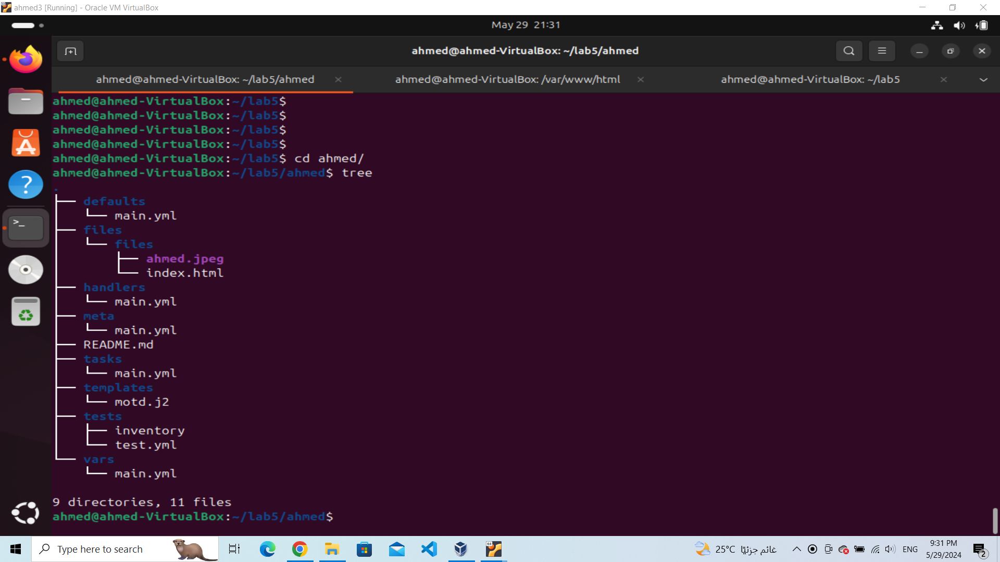
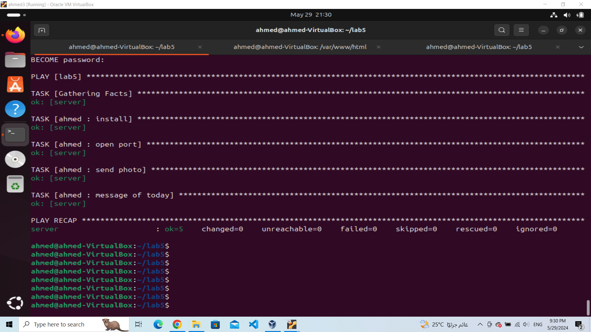
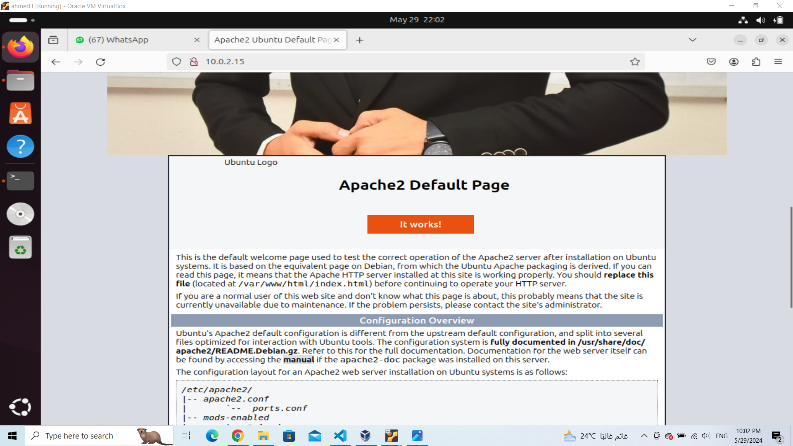

# ivolve internship
## lab5 


Deploying an apace server using ansible roles

## Requirements
Ansible installed on the control machine.
SSH access to the target server with sudo privileges.

### 1. create inventory and ansible.cfg to using defulats
```
server ansible_host = 10.0.2.15  #host IP

```
### 2. initialize an ansible role

In Ansible, a role is a way of organizing and managing tasks, variables, files, and other resources in a reusable and modular manner. Roles allow you to break down complex automation tasks into smaller, more manageable components, making your Ansible playbooks more organized, maintainable, and reusable across different projects or environments.



Then write the tasks to install and configure the apache server in to main.yml file in the tasks dir
** task to install the apache server
```sh
- name: install
  apt:
    name: apache2
    state: present
```
second task to start the apache service
```sh 
- name: start
  service:
      name: apache2
      state: started
      enabled: yes

```

Then i need firewall to allow the http traffic that come or out through port "80"
```sh
- name: open port
  ufw:
    rule: allow
    port: "80"
    proto: tcp

```
Then copy the photo or any files i need to deploy to the correct path to pe published "/var/www/html/....."
```sh
- name: send photo
  copy:
    src: files/ahmed.jpeg
    dest: "{{photo_root}}"   #this variable defined in the vars/main.yml file 

```

### 3. Run ansible playbook 
Theen create an ansible playbook to run the role
```sh 
---
- name: lab5
  hosts: server
  become: true
  vars_files:
    - secr.yml
  roles:
    - ahmed

```
Then run the playbook command
```bash
ansible-playbook -i inventory playbook

```




### 4. the final website of webserver


 

 ********************

