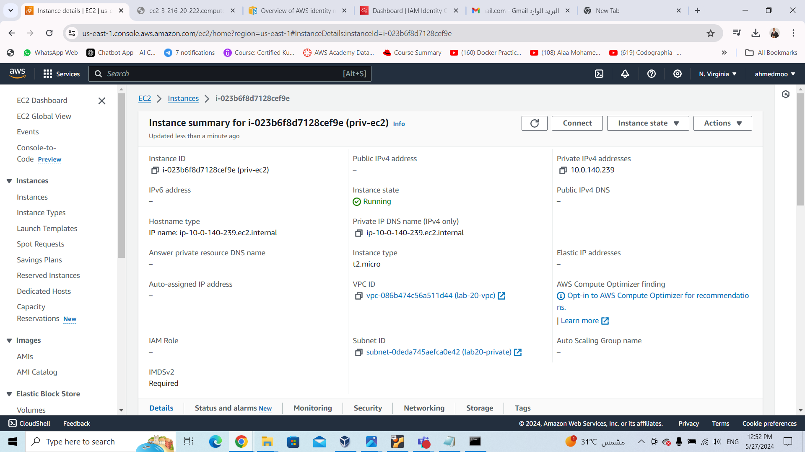

# ivolve internship 

### summary 
Need to create a Bastion host in a public subnet to conect to another ec2 instance in private subnet via SSH 

***
#### 1. Create vpc 

    From AWS management console choose create vpc 
    and detrmine the vpc cidr block


#### 2. Create Subnets
    From VPC dashboard choose subnets
    and then create public subnet "Bastiob host will join it" and private subnet "private ec2 will join it"


#### 2. Launch the EC2 Instance
    Launch an Instance:
    1. The Host:
        after choosing the IAM and finish the basic configuration 
        You must make sure that (Auto-assign public IP) is disabled "private"



    2. Bastion host
       it's an ec2 instance used to connect to other hosts "ex.SSH"
       you must make sure that  (Auto-assign public IP) is enabled "public"
       and configure a secrity group to allow SSH traffic

***

***

#### 4. SSH Connection 
1. Connect to the Bastion Host:
```bash

        ssh -i C:\Users\ahmed\Downloads\lab20.pem ec2-user@3.216.20.222
```
 

2. Connect to the Private Instance via the Bastion Host:
From the bastion host you can use scp command to copy the from local device to the bastion host 
OR create a new file with the same name of the key and copy the content of the key file 
then you can easly connect the private ec2 


*******


```bash
    ssh -i lab20.pem ec2-user@10.0.140.239
```

