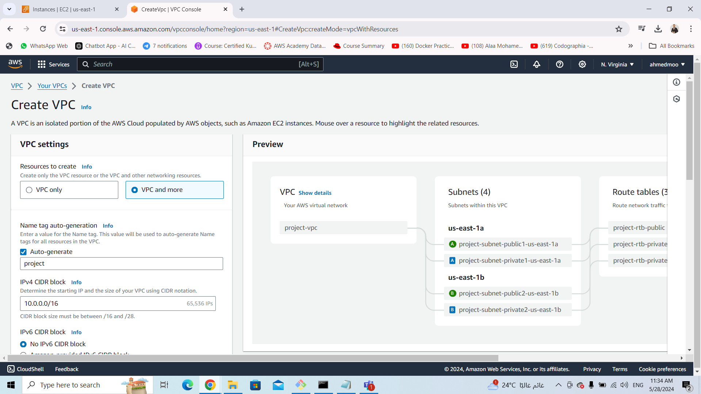
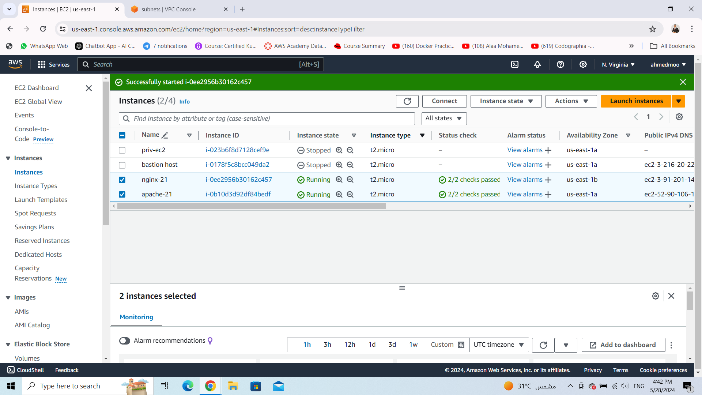
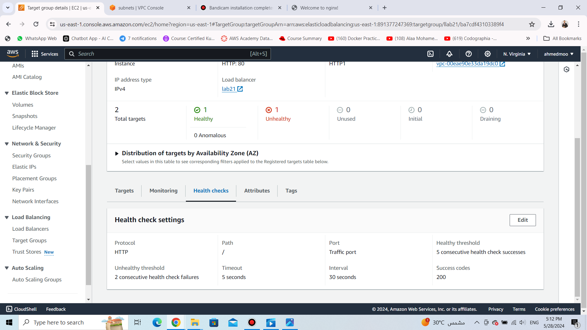
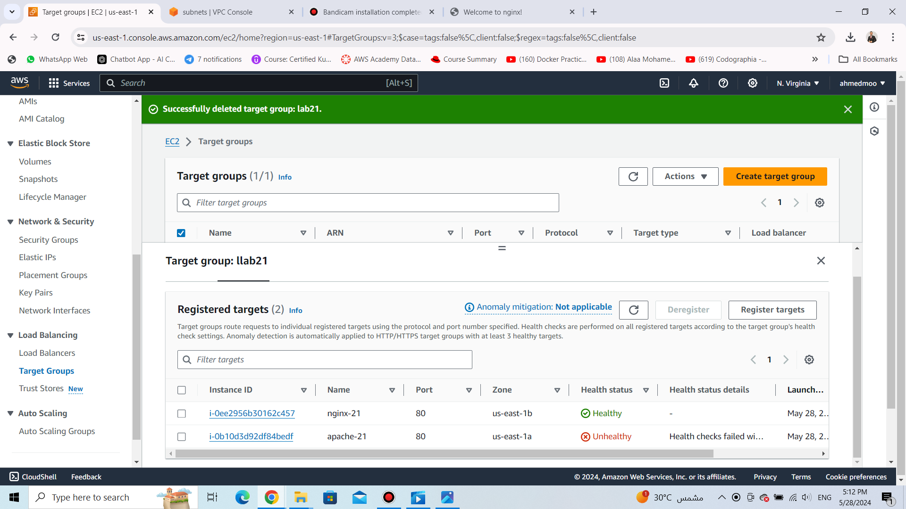
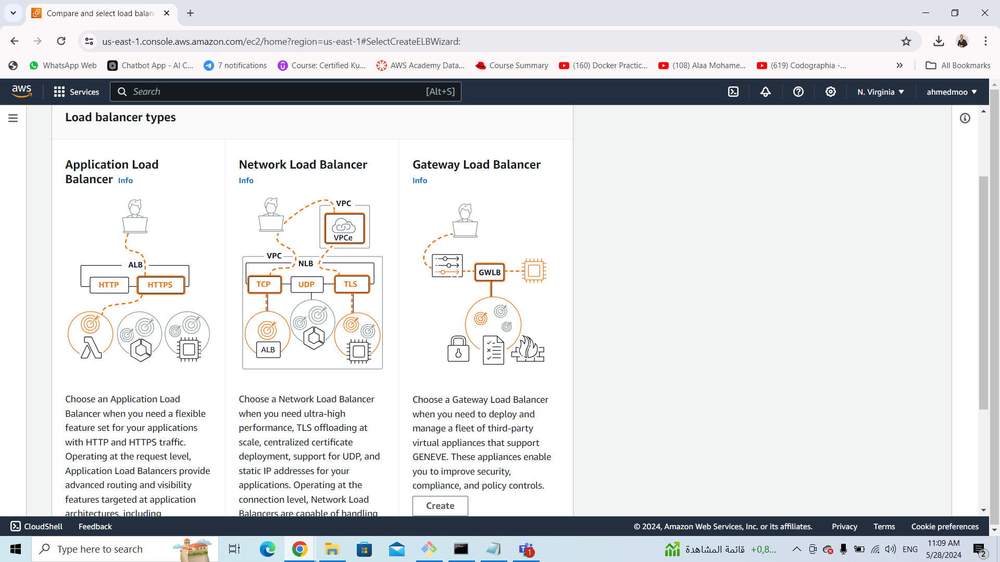
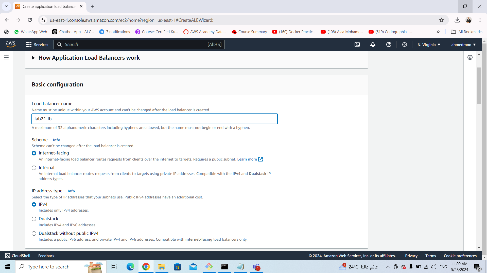

# ivolve-OJT
## Lab21
### VPC 
create a vpc in two different Avaliablte zones and also 
With two public subnets and two private 
eacth AZ has one public and one private 



### EC2s
I need to create two servers " Apache , Nginx " and add them in a target group then use load balancer to balance the requists traffic between them 
frist: create the Apache server within the public subnet in AZ " us-east-1a " .
then write a user data as bash script to install and configure the Apache server and start the httpd service.

```sh
   #!/bin/bash
sudo yum update -y          # Update package lists (for Amazon Linux)
sudo yum install httpd -y   # Install Apache (for Amazon Linux)
sudo systemctl start httpd  # Start Apache
sudo systemctl enable httpd # Enable Apache to start on boot
sudo systemctl status httpd # Confirm Apache is running
```
Second: create the Nginx server with the same steps  but it will be in AZ " us-east-1b ".
And also write a user data to install and configure the nginx 

```sh 
   #!/bin/bash
sudo yum update -y          # Update package lists (for Amazon Linux)
sudo yum install nginx -y   # Install Nginx (for Amazon Linux)
sudo systemctl start nginx  # Start Nginx
sudo systemctl enable nginx # Enable Nginx to start on boot
sudo systemctl status nginx # Confirm Nginx is running
```



#### Target Group
AWS Target Group is part of Elastic Load Balancing, distributing incoming traffic across multiple targets like EC2 instances, containers, IP addresses, or Lambda functions. It routes traffic based on defined criteria, monitors target health, dynamically scales, and enables path-based routing for hosting multiple applications on a single load balancer.

   1- Grouping Targets: First, you create a Target Group and define the targets that will receive traffic. Targets can be instances, IP addresses, or Lambda functions. This grouping allows you to manage and configure settings for these targets collectively.

   2- Routing Traffic: After creating a Target Group, you can configure a load balancer (such as an Application Load Balancer or Network Load Balancer) to route incoming traffic to the targets in this group based on various criteria like HTTP headers, paths, hostnames, or ports.

   3- Health Checks: AWS continuously monitors the health of the targets in the Target Group by periodically sending health checks. If a target is deemed unhealthy, the Target Group stops routing traffic to it until it becomes healthy again.

   4- Dynamic Scaling: Target Groups can dynamically scale in response to changing demand. For example, if you're using an Auto Scaling group with EC2 instances registered with a Target Group, AWS can automatically add or remove instances based on predefined scaling policies.

   5- Path-Based Routing: With Application Load Balancers, you can use rules to forward requests based on the URL path to different target groups. This allows you to host multiple applications or microservices on a single load balancer.
   #########
   Here i used the targett group to check the helth of my two servers Apache and nginx


This the health check for  the two servers


#############


### Load Balancer

AWS Load Balancer evenly distributes incoming traffic across multiple targets, ensuring high availability and fault tolerance. It offers different types like Application Load Balancer (ALB) and Network Load Balancer (NLB), integrates with other AWS services for dynamic scaling, and provides security features such as SSL/TLS termination and protection against DDoS attacks.
Run this command to apload files to my bucket

Here is used Application Load Balancer "ALB" debending on the last Target Group






