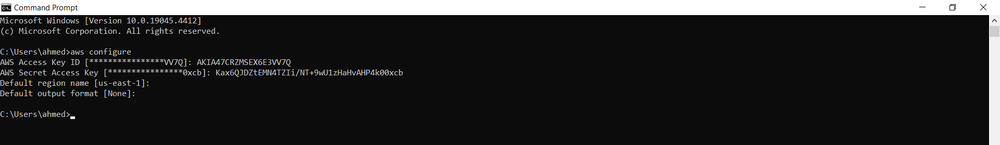
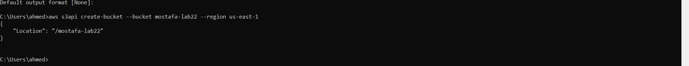
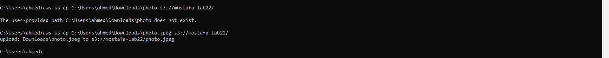
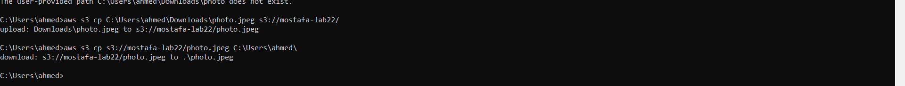
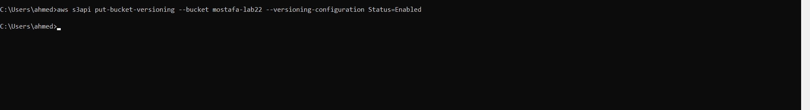
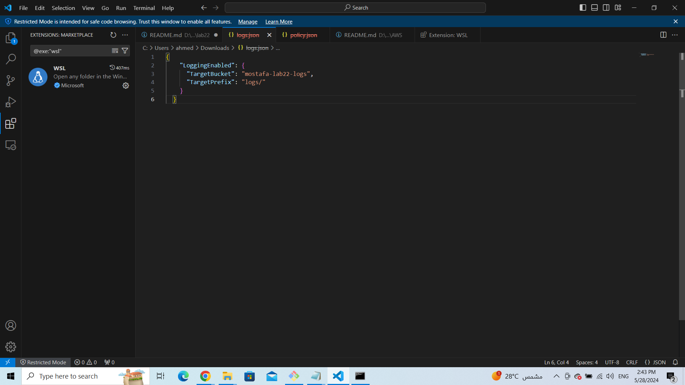
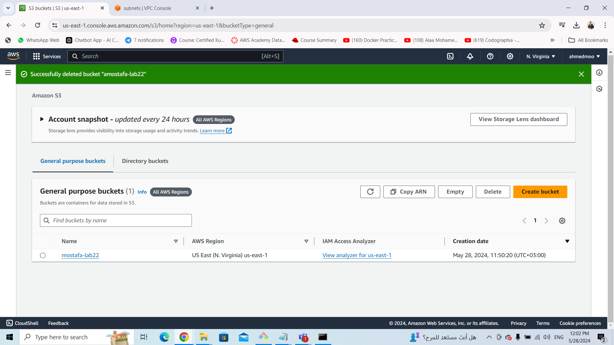
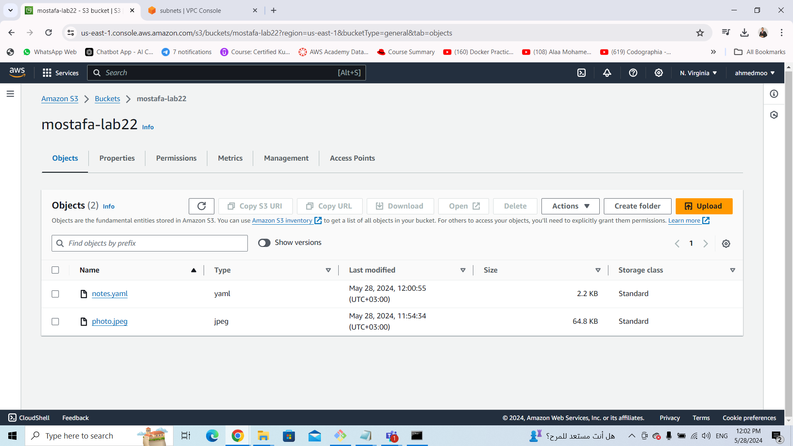
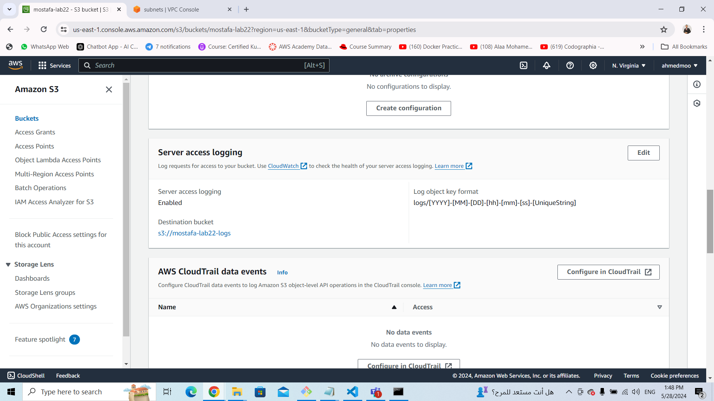

# ivolve-OJT
## Lab22 aws
### Access Key
In This lab i get acces to my aws account through CLI .
get my Access Key and Secrt Access Key


#### Create bucket
Then i create an aws S3 bucket 
 ```sh
    aws s3api create-bucket --bucket mostafa-lab22 --region us-east-1
```
I mantianed my bucket name and the region if this region isn't the default one 



### Upload files
Run this command to apload files to my bucket
```sh
   C:\Users\ahmed>aws s3 cp C:\Users\ahmed\Downloads\photo.jpeg s3://mostafa-lab22/
```
copy the file from my localpc "photo.jpeg" to my aws S3 bucket 



### Download files
Run this command to download any files from my bucket to my locapc
```sh
   C:\Users\ahmed>aws s3 cp s3://mostafa-lab22/photo.jpeg C:\Users\ahmed\
```
reverse the last step, copy the file from my bucket "mostafa-lab22/photo.jpeg" to my localpc



### enable virsioning 
I run this command to enable file versioning to upload multible versions from my file
```sh
   C:\Users\ahmed>aws s3api put-bucket-versioning --bucket mostafa-lab22 --versioning-configuration Status=Enabled
```
When versioning is enabled on an S3 bucket, every object stored in that bucket will have a unique version ID associated with it. This version ID allows you to reference and retrieve specific versions of objects.
it helps to :
1- protect Data
2- always have a backup from my last version data
3- have a data history



### enable logging
Use this command to enable logging on s3 bucket
```sh
   aws s3api put-bucket-logging --bucket mostafa-lab22 --bucket-logging-status file://C:\Users\ahmed\Downloads\config.json
```
Enabling logging on an S3 bucket allows you to track and log requests made to the bucket. When logging is enabled, S3 generates access logs that contain detailed information about the requests, such as the requester's IP address, the time of the request, the request type (e.g., GET, PUT, DELETE), and the HTTP status code.

- Use Cases:
   1- Access Monitoring: Logging allows you to monitor and audit access to your S3 bucket. You can track who is accessing the bucket and what actions they are performing.

   2- Security and Compliance: Logging provides visibility into bucket activity, which can help you detect unauthorized access attempts and ensure compliance with security policies and regulations.

   3- Debugging and Troubleshooting: Access logs can be valuable for debugging and troubleshooting purposes. You can use them to investigate issues, analyze traffic patterns, and identify potential problems.

And we need to provide some configurations in json format



"TargetBucket": The name of the bucket where logs will be stored.

"TargetPrefix": The prefix to prepend to log object keys. This allows you to organize logs within the logging bucket.

## Bucket in console
### results from aws console
######################

######################

######################

#####################

#####################