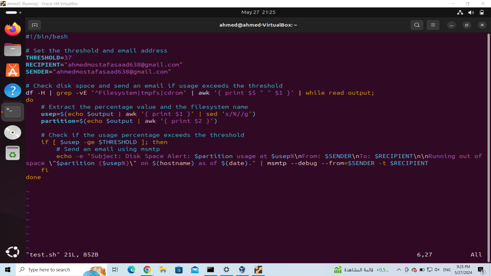
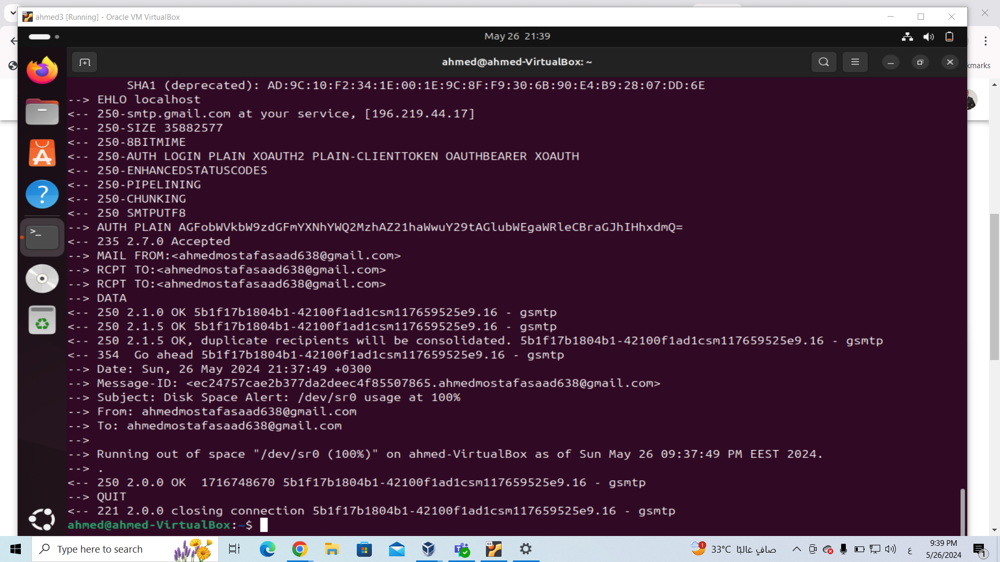
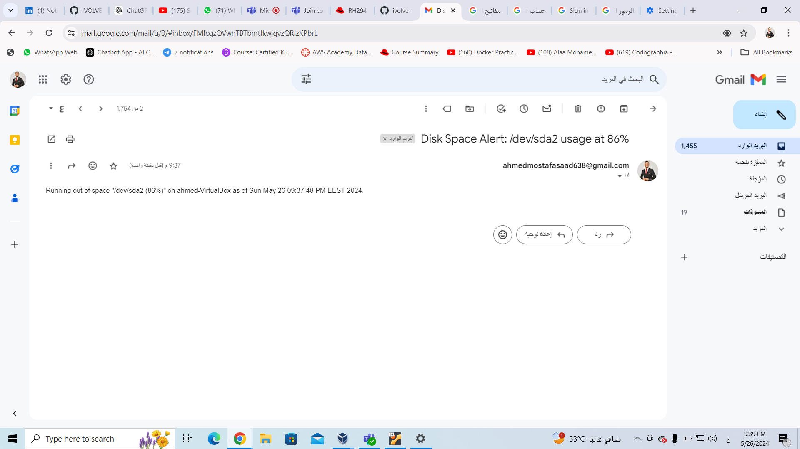

# ivolve internship

## Lab3e Storage usage alart

This script Send me an email as an alarm if my storage usage become over a threshold that i determined using 'msmtp' and 'mailutils' packages


## Prerequisites

1. **msmtp**: Ensure `msmtp` is installed and configured correctly.
2. **mailutils**: Install `mailutils` for `mailx` command if not already installed.

### Installation

1. **Install msmtp and mailutils**:
```bash
    sudo apt update
    sudo apt install msmtp mailutils
```

2. **Configure msmtp**:
    Create a `~/.msmtprc` file with the following content:
```sh
    # Set default values
defaults
auth           on
tls            on
tls_trust_file /etc/ssl/certs/ca-certificates.crt

# Gmail configuration
account       gmail
host          smtp.gmail.com
port          587
from          ..............@gmail.com
user          ..............@gmail.com
password      password

# Set the default account
account default : gmail
```

3. **Set Permissions**:
    Ensure the `~/.msmtprc` file has the correct permissions:

```bash
    chmod 600 ~/.msmtprc
```
4. **Make the Script Executable and Run it**:
 
    ```bash
   chmod +x test.sh
   ./test.sh
    ```


 

 5. **the output**:

  

 6. **mail**:

  
***

***


 
