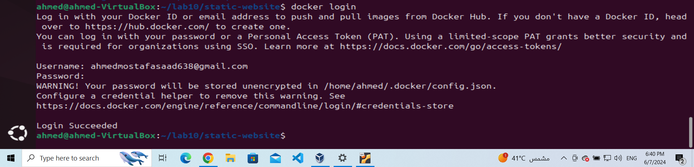
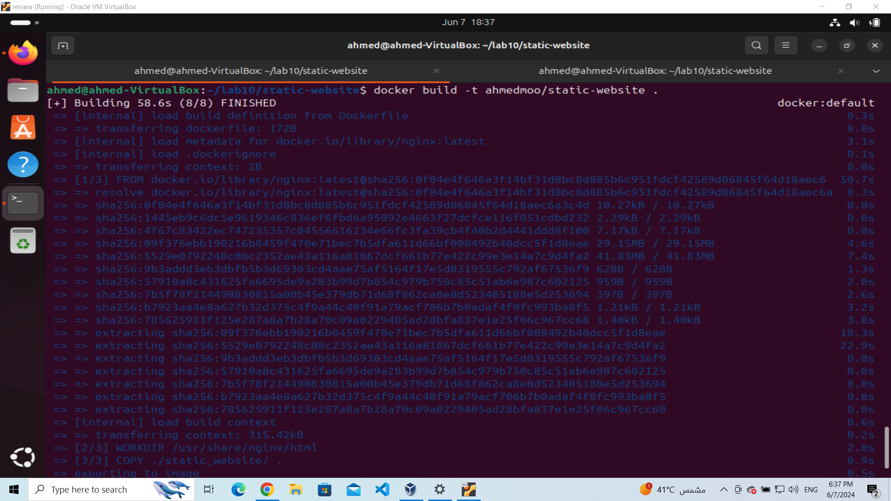
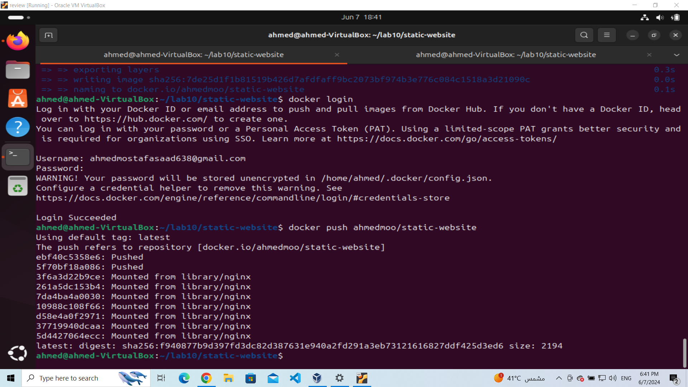
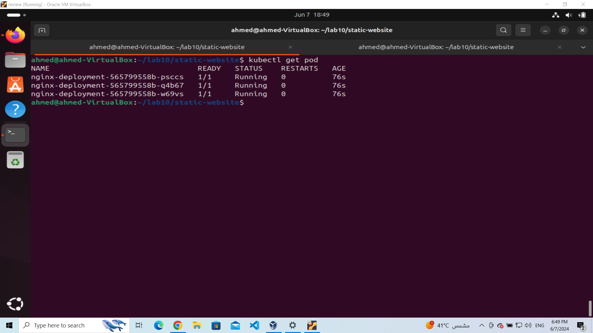
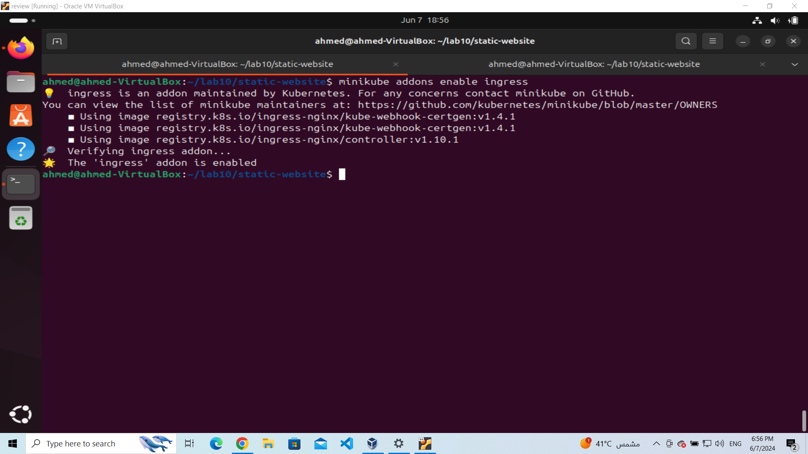
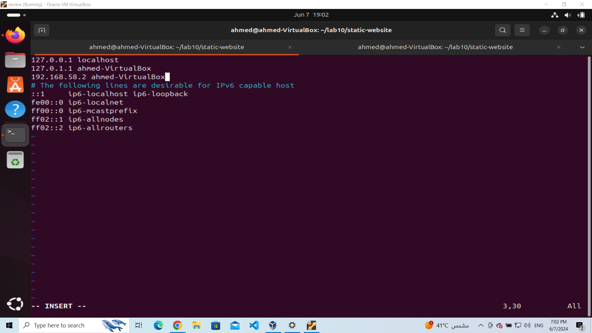

# ivolve
## lab10
# Custom NGINX Deployment on Kubernetes

This repository contains the necessary files and instructions to deploy a custom NGINX service on Kubernetes/OpenShift, expose it via an Ingress resource, and access it using a custom domain name.

## Getting Started

Follow the steps below to deploy the NGINX service and configure the environment:

### 1. Build Image and Push to DockerHub

Clone the repository:
```
git clone https://github.com/IbrahimmAdel/static-website.git
cd static-website
```
login to docker 
```
docker login 
```


Build the Docker image:
```
docker build -t ahmedmoo/static-website .
```


Push the image to DockerHub:
```
docker push ahmedmoo/static-website
```


### 2. Create a Deployment

Apply the NGINX deployment YAML:
```
kubectl apply -f deploy.yaml
```


### 3. Create a Service

Apply the NGINX service YAML:

```
kubectl apply -f serv.yaml
```


### 4. Define a Network Policy

Apply the network policy YAML:

```
kubectl apply -f netpolicy.yaml
```

### 5. Enable NGINX Ingress Controller in Minikube

Enable the NGINX Ingress controller addon:

```
minikube addons enable ingress
```


### 6. Create an Ingress Resource

Apply the Ingress YAML:

```
kubectl apply -f ingress.yaml
```

### 7. Update /etc/hosts

Add a line to map your domain to Minikube IP in /etc/hosts:

```
minikube-ip admed-VirtualBox.com
```

### 8. Access the NGINX Service

Access your service via the domain name: `http://admed-VirtualBox.com`

### 9. Create a Route in OpenShift

Use `oc` CLI to create a route for your application.

