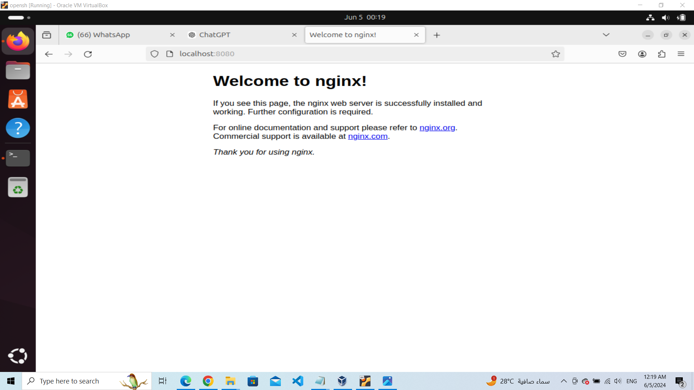

# Helm Chart Deployment Lab in Kubernetes

This lab provides a step-by-step guide to deploy and manage applications in a Kubernetes cluster using Helm charts. We will explore Helm charts for common services, create a new Helm chart for Nginx, deploy it, verify the deployment, and access the Nginx server. Finally, we will delete the Nginx release.

## Prerequisites

1. Access to a Kubernetes cluster.
2. Helm installed on your local machine.
3. kubectl installed on your local machine.
4. Git installed on your local machine.

## Step-by-Step Guide

### 1. Install Helm

Ensure that Helm is installed on your local machine. You can follow the [official Helm installation guide](https://helm.sh/docs/intro/install/) if Helm is not already installed.

### 2. Create a New Helm Chart for Nginx

Create a new Helm chart for Nginx:

```bash
helm create nginx
```

This will create a directory structure for your Helm chart.

### 3. Customize the Helm Chart

Modify the default `values.yaml` file to customize the Nginx deployment. Here is a basic example:

```yaml
replicaCount: 1

image:
  repository: nginx
  pullPolicy: IfNotPresent
  tag: stable

service:
  type: ClusterIP
  port: 80

ingress:
  enabled: false

resources: {}

nodeSelector: {}

tolerations: []

affinity: {}
```

### 4. Deploy the Helm Chart

Deploy the Nginx Helm chart to your Kubernetes cluster:

```bash
helm install my-nginx ./nginx
```

### 5. Verify the Deployment

Verify that the Nginx deployment is successful:

```bash
kubectl get pods
```

You should see a pod with the name `my-nginx`.

### 6. Access the Nginx Server

Expose the Nginx service to access it:

```bash
kubectl expose deployment my-nginx --type=LoadBalancer --name=my-nginx-service
```

Get the URL to access the Nginx server:

```bash
kubectl get service my-nginx-service
```

Open the URL in your web browser to see the Nginx welcome page.



### 7. Delete the Nginx Release

To delete the Nginx release, run the following command:

```bash
helm uninstall my-nginx
```

Verify that the Nginx release has been deleted:

```bash
kubectl get pods
```

