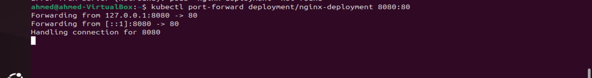

# ivolve
## Lab7 

### Objectives
- Deploy NGINX with 3 replicas.
- Create a service to expose the NGINX deployment.
- Use port forwarding to access the NGINX service locally.
- Update the NGINX image to Apache.
- View the deployment's rollout history.
- Roll back the NGINX deployment to the previous image version.
- Monitor pod status to confirm a successful rollback.

### Prerequisites
- Kubernetes cluster set up and running.
- kubectl command-line tool configured to interact with the cluster.
- Basic knowledge of Kubernetes concepts such as Pods, Deployments, and Services.


### Steps

### 1. Deploy NGINX with 3 replicas service to expose the NGINX deployment
Create a deployment file nginx-deployment.yaml:
```yml
apiVersion: apps/v1
kind: Deployment
metadata:
  name: nginx-deployment
spec:
  replicas: 3
  selector:
    matchLabels:
      app: nginx
  template:
    metadata:
      labels:
        app: nginx
    spec:
      containers:
      - name: nginx
        image: httpd:latest
        ports:
        - containerPort: 80

```
then run the apply command 

```bash
kubectl apply -f deploy.yaml
```
#####################

Create a service file nginx-service.yaml:

```yml
apiVersion: v1
kind: Service
metadata:
  name: nginx-service
spec:
  selector:
    app: nginx
  ports:
    - protocol: TCP
      port: 80
      targetPort: 80
```
Apply the service:

```bash
kubectl apply -f serv.yaml
```

***
### 2. Use port forwarding to access the NGINX service locally


Use oc port-forward to access the service locally:
```bash
kubectl port-forward deployment/nginxdeployment 8080:80

```


Now, you can access the NGINX service at http://localhost:81.


### 3. chane the image on deploy.yml file to apache 
get to the yml file and change the image from nginx to httpd
and the run the apply command
```bash
    kubectl apply -f deploy.yml
```

################
and now if you try to access port 8080 you will get the apache page 


### 4. View the deployment's rollout history
To view the rollout history:

```bash
kubectl rollout history deployment/nginx-deployment
```
and then roll back to get back to nginx image 

```bash
oc rollout undo deployment/nginx-deployment
``` 
 


### Conclusion
By following these steps, you have successfully deployed NGINX with 3 replicas, exposed it via a service, updated the deployment to use another image, viewed the rollout history, rolled back to the previous version, and confirmed the rollback by monitoring the pod status.


