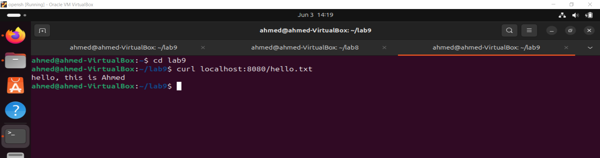
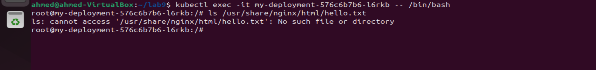
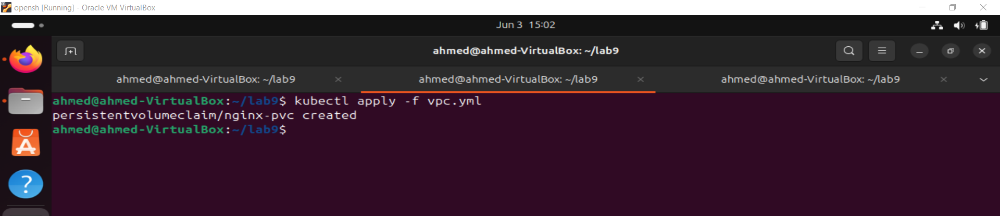

# Lab 9: Storage Configuration
## Overview
In this lab, you will learn about storage configuration in Kubernetes. You will create a Deployment named my-deployment with 1 replica using NGINX image. Then you will execute into the NGINX pod and create a file at /usr/share/nginx/html/hello.txt with the content "hello, this is ( your-name )".    
You'll verify that the file is served by NGINX using curl localhost/hello.txt. Next, you'll delete the NGINX pod and wait for the deployment to create a new pod. After that, you'll execute into the new pod and verify that the file at /usr/share/nginx/html/hello.txt is no longer present. Finally, you'll create a Persistent Volume Claim (PVC) and modify the deployment to attach the PVC to the pod at /usr/share/nginx/html. You'll repeat the previous steps and verify that the file persists across pod deletions.


| Feature      | Persistent Volume (PV)                   | Persistent Volume Claim (PVC)                        |StorageClass                                   |
|----------------------|------------------------------------------------|------------------------------------------|------------------------------------------------|
| **Definition**  | Cluster storage provisioned by admin or dynamically. | User request for storage.                 | Template for dynamic storage provisioning.    |
| **Lifecycle** | Independent of any Pod.                        | Tied to the lifecycle of the Pod using it.| Independent; used for creating PVs.           |
| **Provisioning**     | Manual or dynamic via StorageClass.            | Requests storage from a PV.               | Defines parameters for dynamic PV creation.   |
| **Binding**          | Bound to a PVC or dynamically matched.         | Bound to a PV that meets criteria.        | Used to dynamically create PVs.               |
| **Reclaim Policy**   | Retain, Recycle, or Delete after PVC deletion. | No reclaim policy; follows PV's policy.   | Influences PV reclaim policies.               |
| **Capacity**         | Specifies available storage size.              | Requests specific storage size.           | Affects PV sizes created from it.             |
| **Access Modes**     | Specifies how PV can be used by Pods.          | Requests specific access modes.           | Affects PV access modes.                      |
| **Storage Backend**  | Specific storage solutions (e.g., NFS, cloud). | Abstracted backend details.               | Defines backend storage parameters.           |
| **Configuration**    | Set by admin or StorageClass parameters.       | Set by user needs.                        | Set by admin for storage types.               |
| **User Interaction** | Managed by admins.                             | Used by developers/users.                 | Managed by admins.                            |
| **Dynamic Provisioning** | Can use StorageClass for dynamic creation. | Enables dynamic provisioning via StorageClass. | Enables dynamic PV creation for PVCs.          |


## Objective
By the end of this lab, you will:

- Understand how to configure storage in Kubernetes using Persistent Volumes (PV), Persistent Volume Claims (PVC), and StorageClasses.
- Learn how to attach storage to a Pod to persist data across Pod recreations.

## Prerequisites
- Basic understanding of Kubernetes concepts.
- A running Kubernetes cluster.
- kubectl installed and configured to interact with your cluster.

## Steps
### Step 1: Create NGINX Deployment
Create a Kubernetes Deployment named my-deployment with 1 replica using NGINX image from the mydep.yaml

```yml
apiVersion: apps/v1
kind: Deployment
metadata:
  name: nginx-deployment
spec:
  replicas: 1
  selector:
    matchLabels:
      app: nginx
  template:
    metadata:
      labels:
        app: nginx
    spec:
      containers:
      - name: nginx
        image: nginx:latest
        ports:
        - containerPort: 80
        volumeMounts:
        - name: nginx-pvc
          mountPath: /usr/share/nginx/html
      volumes:
      - name: nginx-pvc
        persistentVolumeClaim:
          claimName: nginx-pvc

```

```bash
kubectl apply -f mydep.yaml
```
### Step 2: Verify File Serving
Execute into the NGINX pod and create a file at /usr/share/nginx/html/hello.txt with the content "hello, this is  Ahmed".

```bash
kubctl exec -it  my-deployment-576c6b7b6-l6rkb -- /bin/bash
echo "hello, this i Ahmed" > /usr/share/nginx/html/hello.txt
exit
```

Verify that the file is served by NGINX using curl localhost/hello.txt.

```sh
curl localhost:8080/hello.txt
```


### Step 3: Delete and Recreate Pod
Delete the NGINX pod and wait for the deployment to create a new pod.
```bash
delete pod my-deployment-576c6b7b6-l6rkb
```
and then try to show the contant in /usr/share/nginx/html/hello.txt 
it's not found



### Step 4: Create Persistent Volume Claim (PVC)
Create a Persistent Volume Claim (PVC).

```yml
apiVersion: v1
kind: PersistentVolumeClaim
metadata:
  name: nginx-pvc
spec:
  accessModes:
    - ReadWriteOnce
  resources:
    requests:
      storage: 1Gi

```
```bash
kubectl apply -f vpc.yaml
```

### Step 5: Modify Deployment to Attach PVC
Modify the deployment to attach the PVC to the pod at /usr/share/nginx/html.

```yml
apiVersion: apps/v1
kind: Deployment
metadata:
  name: nginx-deployment
spec:
  replicas: 1
  selector:
    matchLabels:
      app: nginx
  template:
    metadata:
      labels:
        app: nginx
    spec:
      containers:
      - name: nginx
        image: nginx:latest
        ports:
        - containerPort: 80
        volumeMounts:
        - name: nginx-pvc
          mountPath: /usr/share/nginx/html
      volumes:
      - name: nginx-pvc
        persistentVolumeClaim:
          claimName: nginx-pvc
```

```bash
kubectl apply -f mydep.yaml
``` 
Step 6: Verify File Persistence
Repeat the previous steps and verify that the file persists across pod deletions.


***

## Conclusion
In this lab, you learned about storage configuration in Kubernetes using Persistent Volumes (PV), Persistent Volume Claims (PVC), and StorageClasses. You successfully attached storage to a Pod to persist data across Pod recreations.


